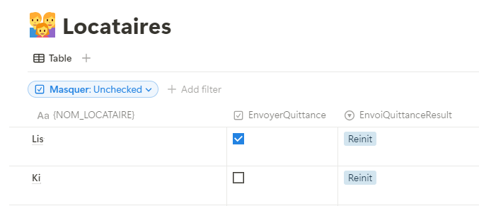
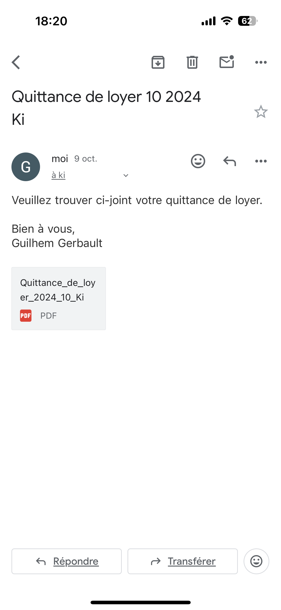
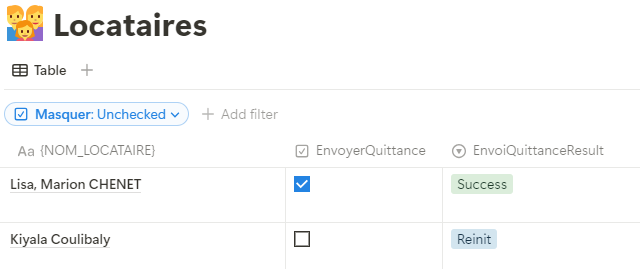
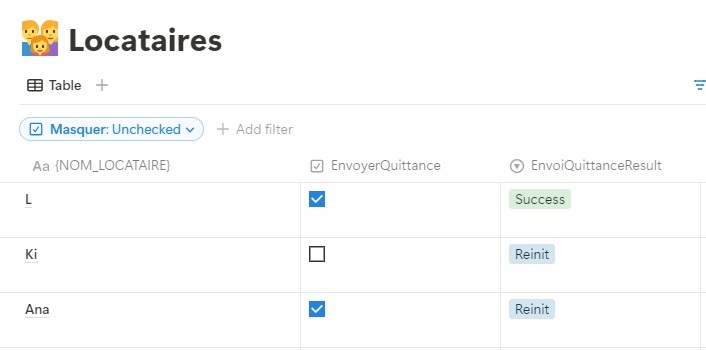

= Lease_Generator
Leases_Generator

An automated tool for generating residential leases based on tenant, guarantor, and property data. 
Connected to **Notion** for data management and Google Docs for document generation.

== Overview
Lease_Generator is a tool designed to automate the creation of residential leases by automatically retrieving information about tenants, guarantors, properties, and rooms from Notion. It then generates Google Docs documents based on this data and exports the leases in PDF format.

== Features
- Automatically retrieves tenant, guarantor, property, room, and real estate data from Notion.
- Automatically generates Google Docs based on a predefined template.
- Allows customization of lease templates.
- Exports generated leases in PDF format.

== Uses Cases  

=== Use Case 1 : User checks "Send Receipt" field in Notion to send an email to the adequate tenant
==== Features 
- on "Send Receipt" field checked in Notion Tenant database, send an email to the tenant with a receipt of the montly payment based on the information of the tenant


- the tenant then receives the email with the attached receipt


- the Notion database field "Sending Result" is then updated with the result of the process



==== System Design 
image::images/use_case_1-drawio.svg[System Design overview]


== Configuration for Launch (Environment Setup)

=== Prerequisites
- A Notion account with the required databases configured.
- Notion API activated and integrated with your workspace.
- A Google account with access to Google Docs and Google Drive.
- Google API enabled for authentication and service access.
- Python installed on your machine with a virtual environment set up.

=== Setup Steps

1. Update the code to include the ID of your Google template for leases and guarantee deeds.
2. Create a `mysecrets/` directory and add a file named `notion_secrets.py` with the following content:
   ```python
   NOTION_API_SECRET = "key_to_your_notion_integration"
   DATABASE_IDS = {
     "property": "ID of your Property database",
     "tenant": "ID of your Tenant database",
     "rooms": "ID of your Rooms database",
     "guarantors": "ID of your Guarantors database"
   }

