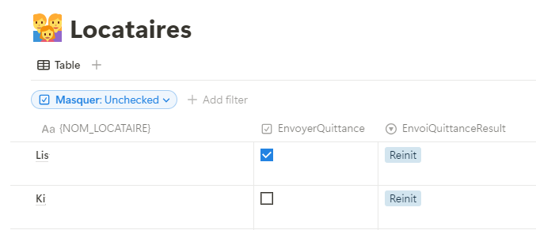
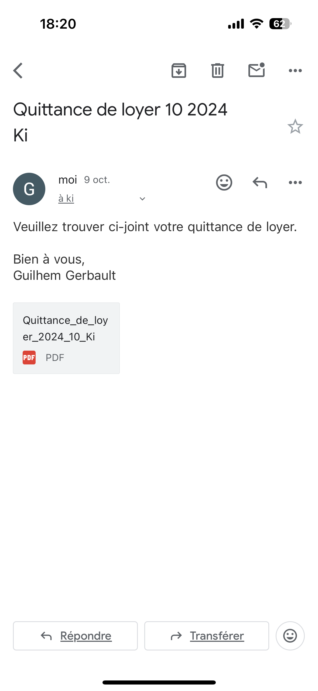
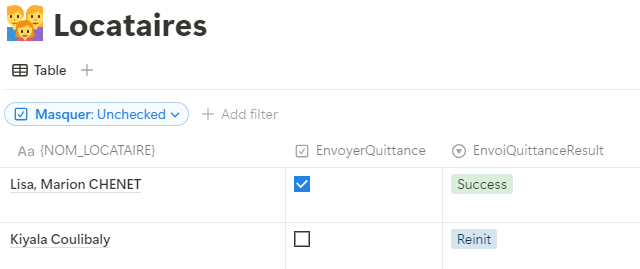
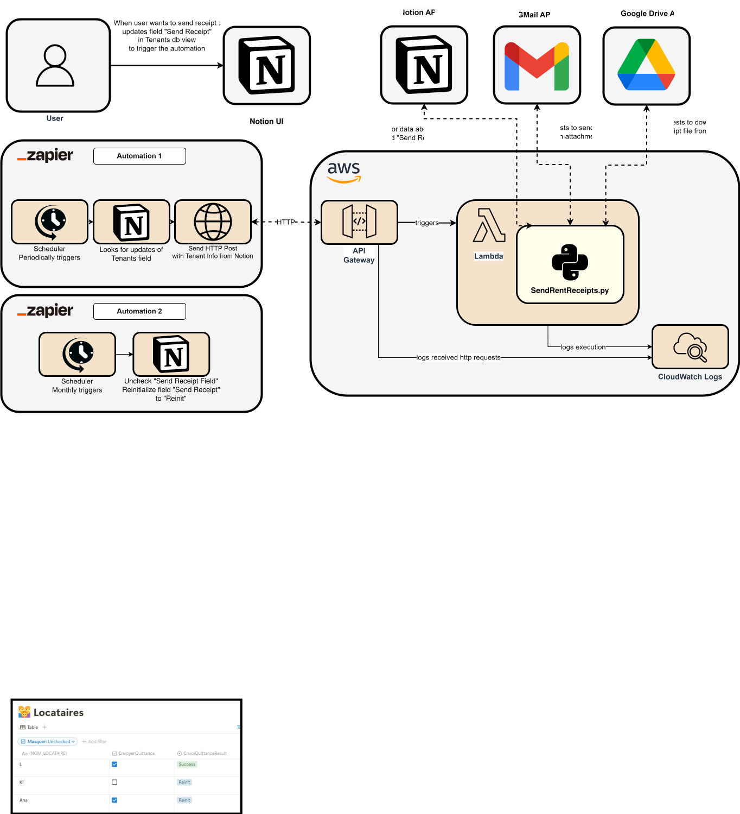

= Lease Generator
:toc:
:toclevels: 2

Lease Generator automates lease and rent receipt production from Notion data, then delivers finalized documents through Google services.

== Why this project

This codebase is a practical example of turning repetitive property-management workflows into reliable, testable automation:

* Pull structured data from Notion databases.
* Build lease or receipt payloads in the domain layer.
* Generate Google Docs from templates and export as PDF.
* Optionally send receipts by email and write execution results back to Notion.

== Core capabilities

* Lease generation from tenant, guarantor, room, and property records.
* Monthly receipt generation.
* “Send receipt” orchestration flow driven from Notion checkboxes.
* Result tracking in Notion (success/failure status updates).
* Unit and end-to-end test coverage for the most critical flows.

== Architecture at a glance

The repository follows a layered approach:

* `src/domain/` for business entities and domain services.
* `src/use_cases/` for orchestration logic (application layer).
* `src/adapters/` for integrations (Notion, Google, mappers).
* `tests/` split between focused unit tests and e2e scenarios.

This separation helps keep domain logic isolated from external APIs, which makes refactoring and testing easier.

== Main use case: Send a receipt from Notion

When a user checks the `Send Receipt` field in the Tenant database:

. Tenant and related payment data are loaded.
. A receipt document is generated from template data.
. An email with the receipt attachment is sent to the tenant.
. The `Sending Result` field is updated in Notion.

== Setup

=== Prerequisites

* Python 3.11+ (recommended).
* A Notion workspace + API integration.
* Google APIs enabled (Docs, Drive, Gmail depending on the flow).
* Credentials for both Notion and Google integrations.

=== Environment configuration

. Create a virtual environment:
+
[source,bash]
----
python -m venv venv
----

. Create `mysecrets/notion_secrets.py`:
+
[source,python]
----
NOTION_API_SECRET = "key_to_your_notion_integration"
DATABASE_IDS = {
    "property": "ID of your Property database",
    "tenant": "ID of your Tenant database",
    "rooms": "ID of your Rooms database",
    "guarantors": "ID of your Guarantors database",
}
----

. Add Google credentials/config expected by the adapters.

== Run

[source,bash]
----
python main.py
----

== Tests

Run the full test suite:

[source,bash]
----
pytest -v
----

Run only end-to-end lease generation:

[source,bash]
----
pytest tests/e2e/test_generate_lease_e2e.py -v
----

== Interview/demo framing

If you use this project for a technical interview, highlight:

* Clear separation between domain logic and external integrations.
* Incremental refactoring strategy from legacy/vibe-coded flows to use-case-driven code.
* Defensive adapter boundaries (mappers + provider abstractions).
* Automated checks that protect the highest-risk user paths.
